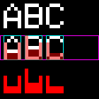
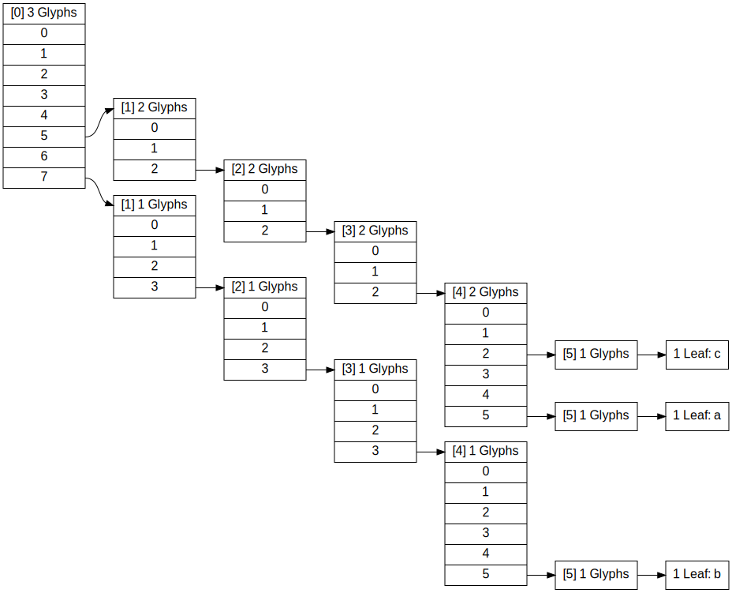

# histogram_text_matcher

A crate to perform (blisteringly fast) histogram-based OCR on images. It was written to recognize
text in a particular game, but it should be applicable in any scenario where the appearance of
characters is independent of their position and the letters are an unique color that can be
transformed into a histogram[^1].

Some variation of the fonts can technically be handled by introducing more glyphs into the glyph set
as the glyph set can contain multiple entries for one letter and a glyph can comprise two letters.

This readme is mostly for myself such that I can figure out how to use this a few years
from now.

## Glyphs and histograms

Before any text can be matched in an image, we need to determine glyph set to do so. The
`image_support::dev_image_to_glyph_set` function can be used to perform this step. It will assume
the color of interest in the image is white. It will segment lines from the image, lines should be
separated by at least one entire row of black. For each line it will try to segment the individual
glyphs, again it will assume an entire column of black denotes the space between two characters.

This gives us rectangles that bound each glyph. Then, for each column in this rectangle it will
count the number of white pixels, the counts of each column together make up the histogram of this
particular glyph.

For example, consider the following image made with some test glyphs scaled up by a factor of five:



Here we have three glyphs, `A`, `B` and `C` on the first row. On the second row we see the output of
the glyph `dev_image_to_glyph_set` function, magenta depicts the line, cyan the glyph border, the
histogram is overlaid in semi-transparent red. The third row shows the histograms for each glyph.

For this particular font (ignoring the scaling of a factor of five) we would obtain the
following histograms for each glyph:

- `A`: `[5, 2, 2, 2, 5]`
- `B`: `[7, 3, 3, 3, 5]`
- `C`: `[5, 2, 2, 2, 2]`

Notice that this segmentation (and thus the histograms) ignore any spacing between letters and also
any spacing that is inherently associated to the letter (the left and right side bearing). When the
left and right side bearing is taken into account, the histogram for `A` may look like
`[0, 5, 2, 2, 2, 5, 0]`, more on this later.


## Matching glyphs

To find which glyphs are present in a particular line of text in an image, the line of text will be
converted into a histogram by counting the pixels of a particular color in each column. Then, this
histogram can be used to match glyphs.

For real usage this is done by the `bin_glyph_matcher` function, this function takes the histogram
that represents a line. In practice, this histogram will likely contain a lot of zeros. So to make
this all a bit faster this function operates in two modes internally. It is either trying to match
glyphs in so called `stripped` mode, or not. When operating in stripped mode, any bins that are zero
in the input histogram are skipped. When the first non-zero bin is encountered, the glyph matcher is
used to try and find a matching glyph using the glyphs histograms (also with the left-zero's
removed). If a matching glyph is found, the function switched to non-stripped mode and the side
bearing is no longer stripped, instead the glyph matcher is used to find glyphs using the
non-stripped histograms.

As an example consider the input histogram made from a line of text in the image:
- `[0, 0, 0, 0, 7, 3, 3, 3, 5, 0, 5, 2, 2, 2, 5, 0, 0, 0, 0, 0]`

Initially, the glyph matcher operates in stripped mode and gobbles up all the zeros at the start, 
resulting in:
- `[7, 3, 3, 3, 5, 0, 5, 2, 2, 2, 5, 0]`

After which the `B` symbol is matched successfully, the remaining histogram is now:
- `[0, 5, 2, 2, 2, 5, 0, 0, 0, 0, 0]`

Since a glyph was successfully matched the zero is no longer stripped, instead the matching is now
performed against the histograms with side bearings, and the example `[0, 5, 2, 2, 2, 5, 0]`
histogram for the letter `A` with side bearing matches, so the remaining histogram now is:
- `[0, 0, 0, 0]`

After which no histogram matches, and the algorithm switches back to stripped mode, eliminating all
the zero bins and finishing the original input line. In this case it has matched:
- 4 whitespace, glyph `B`, glyph `A`, 4 whitespace

### The matcher

In the previously described algorithm, zero bins are cheap but whenever a non zero bin is
encountered all glyphs need to be considered to verify if any of them would match the remaining 
histogram. Doing this with a linear search is slow and this all should be fast, like realtime fast.

So, instead of comparing the histogram against all glyph histograms, the input histogram will be
used and the glyph set is represented in a tree like data structure. When the input histogram is
first passed to the matcher it will start at the tree's root node. The value of the first is used as
an index to determine which branch / edge from the root should be taken, if the edge doesn't exist
the matcher knows no glyph can match this histogram. If it does, the matcher will update its
location in the tree and it will look up the value of the second histogram bin, again using the
value of the bin to index into the possible branches of the tree.

Consider the glyphs and histograms from before (without side bearing), the tree structure looks as:



All searches start at the top left, at index `[0]`, if the input histogram is `[2, 7, 3, 3, 3, 5]`,
the input histogram's first bin value is `2`. The index `2` doesn't have an edge, so the matcher
returns that no glyph matches this. The matcher itself is done at this point.

If the input histogram becomes `[7, 3, 3, 3, 5]`, the first bin value is `7`, this edge exists and
the matcher advances to considering bin index `[1]`, it is now using the table at which we arrived
by following the edge with value `7`, at index `[1]` the input histogram's value is `3`, that edge
exists and the lookup advances to `[2]`... and so on. The traversal keeps going until either; no
edge exists or a leaf is reached. Even though only one glyph is possible at this point, the search
can't terminate yet, because later bins in the input histogram may not match this glyph.

## Image to histograms

So far everything has just involved one dimensional histograms. Images are two dimensional and
somewhere in this image there may be text that should be matched. To convert the two dimensional
image into a one dimensional histogram, a window is slid over the image, this is done by the
`moving_windowed_histogram` function. The input histogram is updated as rows move into the histogram
on one end and out of the histogram on the other end. The window's height is equal to the maximum
line height of the particular glyph set that is being matched.

Multiple colors may be of interest, each color can be given a label. This makes it possible to
detect multiple colors of text at the same time, but still preserve the information about which
color they were originally in the text, effectively labelling the matched glyphs.

## Image to text

As the window moves over the image, it may contain half a letter, or there may just be pixels in the
image that just happen to be equal to our colors of interest. These matches are likely low quality
and not of interest. To deal with this the final algorithm takes shape:

While the window moves over the image, container with matches-under-consideration is kept. Then, the
following steps are iterated for each window position:
- Use the input histogram to determine matching glyphs (`bin_glyph_matcher`).
- Combine matched glyphs into blocks of consecutive matches (`match_resolver`).
- Decide which matches are to be kept in consideration (`decide_on_matches`).
- Save matches under consideration that are no longer touching the window (`finalize_considerations`).
- Advance the window to the next row.

All matches have a rectangle associated to them based on where in the one dimension histogram they
were matched and given the height and vertical position from the window at the point they were
matched. In the `decide_on_matches` function, all new matches are iterated over, if they overlap
with any match from the in-consideration bin, only the match with the largest amount of matching
pixels is selected. This ensures that the matches that are correct (window exactly over a line) are
the ones that end up being selected.


## How to use

To see an example, ensure the `/tmp/test_moving_window/` directory exists and run the unit tests.
The moving window unit test will write an html there that shows matches were found.

- `dev_image_to_glyph_set`: Used to create a glyph set from a particular input image. It will write
a collection of output files into a directory, the yaml (or json) file will contain the histograms
and dummy names for each glyph. This is without the side bearing, that can be added manually.
- `dev_glyph_set_print`: Renders a particular glyph set - so only the histograms.
- `dev_scan_image`: Scan an image using the provided glyph set and output the html with matches for
inspection.

### Making glyph sets.
Is most easily done with the 'new' `dev_images_to_glyph_set` example. This writes all its output to
the `/tmp` directory, including the glyph file. Its input is a yaml file that holds the collection:

```yaml
# The directory to load the files from.
base_dir: "/tmp/"

# the ROI, just as a yaml reference to use later.
_tooltip_rect: &tooltip
  x: 674
  y: 29
  w: 571
  h: 37

# Whether to add zero's at the start and end of each letter, this is necessary for the 
# histogram_glyph_matcher function, but it should not be used when using the longest glyph matcher
# which is usually used with match_histogram_to_string.
histogram_add_zero_start_end: false

# The length of the space character, it adds a " " glyph with the appropriate properties.
space_min_size: 11

# Some letters may fall apart into two elements in the histogram, this allows specifying how many
# segments a letter takes up.
char_intervals:
  P: 2
  k: 2

# Then follows a list of images.
images:
  -
    # The file path relative to the base directory.
    file_path: "Screenshot648.png"
    # The roi
    roi: *tooltip
    # The text that is seen in this ROI
    text: "Eldritch the Rectifier"
    # The color to mask against.
    color: [199,179,119]
  -
    file_path: "Screenshot601.png"
    roi: *tooltip
    text: "Defiled Warrior"
    color: [255,255,255]
```

## License
License is `MIT OR Apache-2.0`.

[^1]: That means; no kerning, no ligatures, no transparancy or anti-aliasing that affects the color
used for detection.
